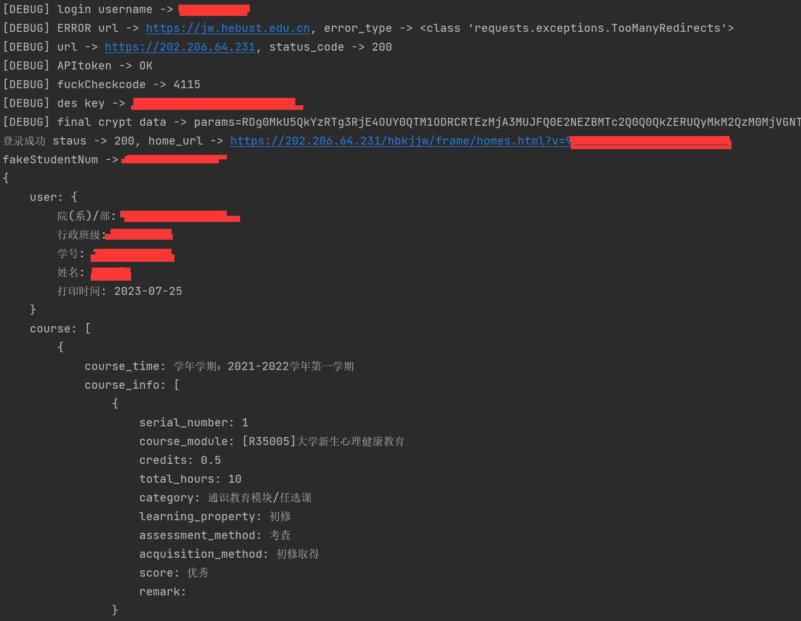

# fuck_hebust_login

## 仅供学习交流使用

## 仅供学习交流使用

## 仅供学习交流使用

## 使用方法

AI生成的项目解析，**请确保运行环境已经安装`Node.js`**

新建类`HebustLogin`并传入学号密码或者在`config.py`配置，调用`HebustLogin.login()`即可登录，返回一个登陆成功的`request.session()`对象

新建类`HebustFunc`并传入学号密码或者在`config.py`配置，调用`HebustFunc.getAcademicRecord()`即可获得成绩字典，调用`HebustFunc.getTimetable()`即可获得课表字典

更多细节请自行看代码和函数说明

## baiduocr.py

这个`baiduocr.py`文件是用来调用百度OCR（Optical Character Recognition）服务的代码。它包括以下功能：

1. `bdRequest(url, data)`函数用于发送HTTP请求，并返回结果字符串。
2. `bdFuckCode(fuck_save_path)`函数是主要的OCR函数。它使用了百度OCR的API和用户提供的API密钥，获取OCR识别结果。函数首先获取访问令牌，然后读取要识别的图片文件，并将其转换为Base64编码字符串。最后，它发送图片识别请求并将结果解析为文本。
3. 文件具有一些配置参数，如`API_KEY`，`SECRET_KEY`和`OCR_URL`，它们存储在名为`config`的其他Python模块中。

该文件的主要功能是将图片中的文字识别为可读文本。它使用了百度OCR服务和API密钥来实现这个功能。

## config.py

这个配置文件的名称是config.py，它包含了一些用于配置程序功能的变量和设置。这些设置包括用户名和密码、密码加密选项、验证码登录选项、保存验证码图片选项、输出cookie选项以及百度云OCR的API密钥和URL。通过更改这些变量的值，可以对程序的行为进行定制。

## cryptparams.py

这个文件是一个名为"cryptparams.py"的Python源代码文件。它包含一个类"CryptParams"，用于处理加密参数。该类包含以下方法和功能：

1. 构造函数：接收用户名、密码、登录请求和URL信息作为参数，并进行相应的初始化。
2. cryptParam方法：根据传递的参数生成加密参数值，并返回加密参数。
3. setCode方法：从验证码图片中识别验证码，并返回识别的验证码值。
4. isPasswordPolicy方法：检查密码是否符合密码策略，并返回相应的标志。
5. checkParams方法：检查密码的字符类型，并返回相应的标志。
6. inUserzh方法：检查密码是否包含用户名，并返回相应的标志。
7. getEncParams方法：根据传递的参数和DES密钥生成加密参数，并返回加密参数。
8. pyExecJsCryptParam方法：使用execjs模块执行JavaScript代码，对参数进行加密，并返回加密后的结果。
9. charType方法：根据字符的ASCII值判断字符的类型。
10. hex_md5方法：计算字符串的MD5哈希值，并返回哈希值。

除了类和方法之外，该文件还导入了一些Python模块（如hashlib、os、random、re、config、requests和base64）。

## hebustfunc.py

该文件名为hebustfunc.py，代码主要包括一个类HebustFunc和一些辅助函数。这个类继承了一个名为HebustLogin的类，并添加了两个方法：getAcademicRecord和getTimetable。getAcademicRecord方法用于获取学术成绩记录，getTimetable方法用于获取课程表。还有一个静态方法recursivePrintDict用于递归打印字典数据。该文件通过导入requests、BeautifulSoup、re、base64和hebustlogin模块来实现相关功能。

## hebustlogin.py

该程序文件是一个名为HebustLogin的类，用于实现河北科技大学教务系统的登录功能。它使用requests库进行HTTP请求，并使用base64和AES进行数据加密和解密。该类的主要方法包括：

- `__init__(self, username="", password="")`：初始化方法，接收用户名和密码作为参数。如果不传入参数，则从config.py文件中读取默认的用户名和密码。如果开启了密码加密，则传入加密后的密码。
- `login(self)`: 登录方法，发送登录请求并验证登录是否成功。
- `getCookie(self)`: 获取登录成功后的cookie。
- `getHomeUrl(self)`: 获取登录成功后的主页URL。
- `getUsername(self)`: 获取登录的用户名。
- `aes_decrypt(self, key, iv, encrypted_data)`: AES解密方法，用于解密加密的密码。

此外，该文件还定义了一些私有方法和属性，用于实现登录功能的逻辑。

## main.py

这是一个主程序文件，文件名为main.py。该程序首先导入了hebustfunc模块和os模块。然后，在主程序中，它打印出当前的运行目录。接下来，它创建了一个HebustFunc的实例对象，并调用了该实例对象的getAcademicRecord和getTimetable方法，将返回结果分别赋值给了academicRecord和timetable变量。最后，它使用实例对象的recursivePrintDict方法分别打印出了academicRecord和timetable的内容。

## 整体功能。

| 文件名         | 功能                                                         |
| -------------- | ------------------------------------------------------------ |
| baiduocr.py    | 调用百度OCR服务进行图片文字识别，用于验证码识别。            |
| config.py      | 存储配置参数，用于配置程序功能。                             |
| cryptparams.py | 生成和处理加密参数，包括密码加密和验证码识别等功能。         |
| hebustfunc.py  | 实现河北科技大学教务系统的学术成绩和课程表获取功能。         |
| hebustlogin.py | 实现河北科技大学教务系统的登录功能，包括用户名密码加密和登录验证。 |
| main.py        | 主程序文件，创建HebustFunc对象，并调用其方法获取学术成绩和课程表，并打印结果。 |

整体功能：该程序使用百度OCR服务进行图片文字识别，并实现了河北科技大学教务系统的登录功能，可以获取学术成绩和课程表。

